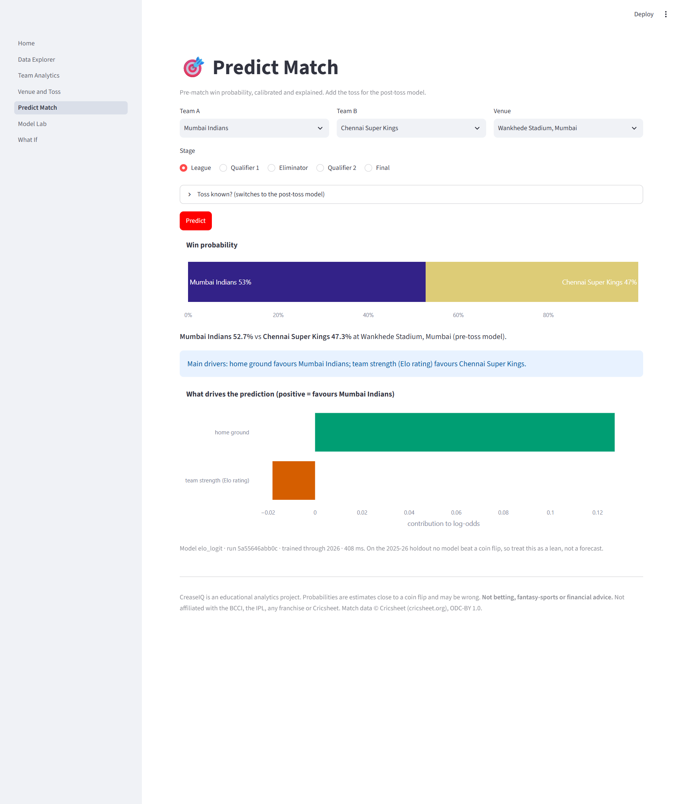
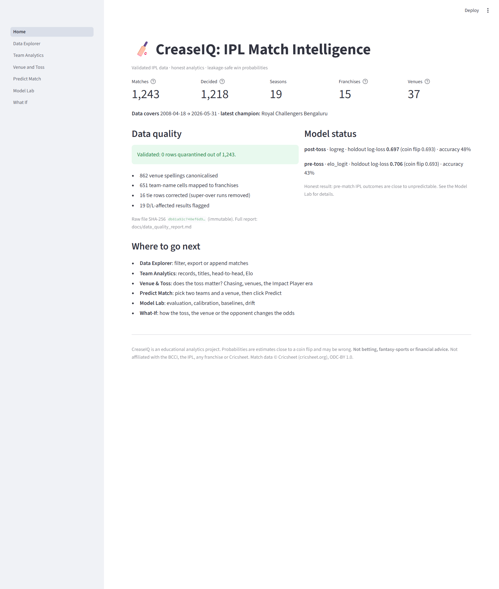
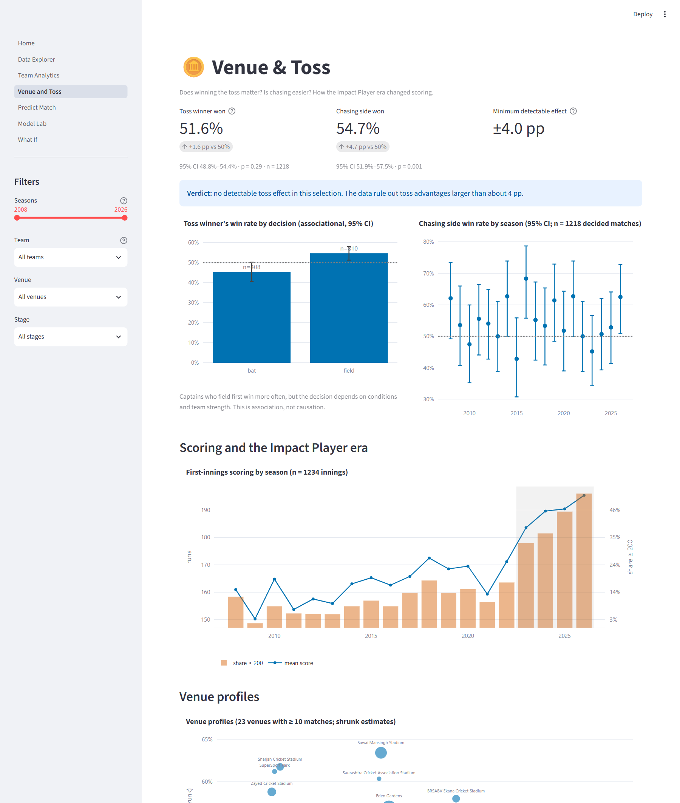
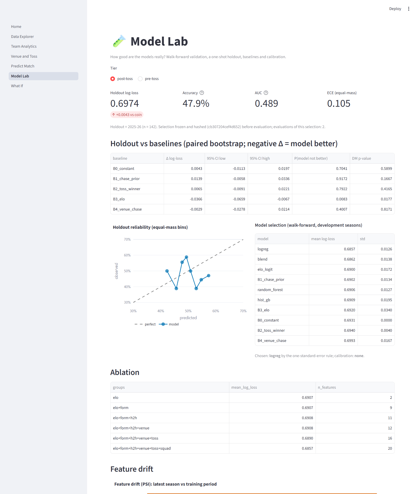
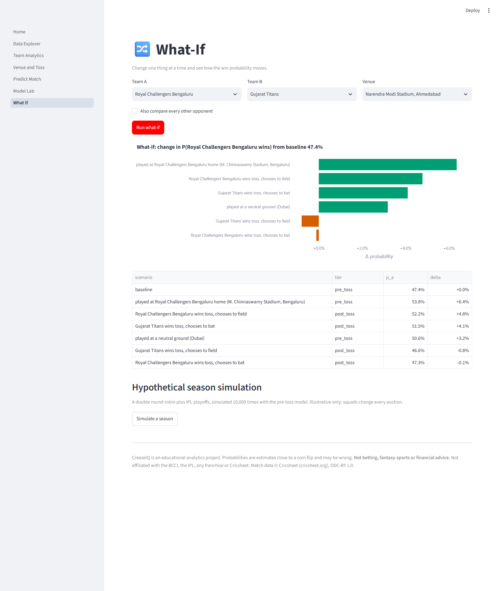
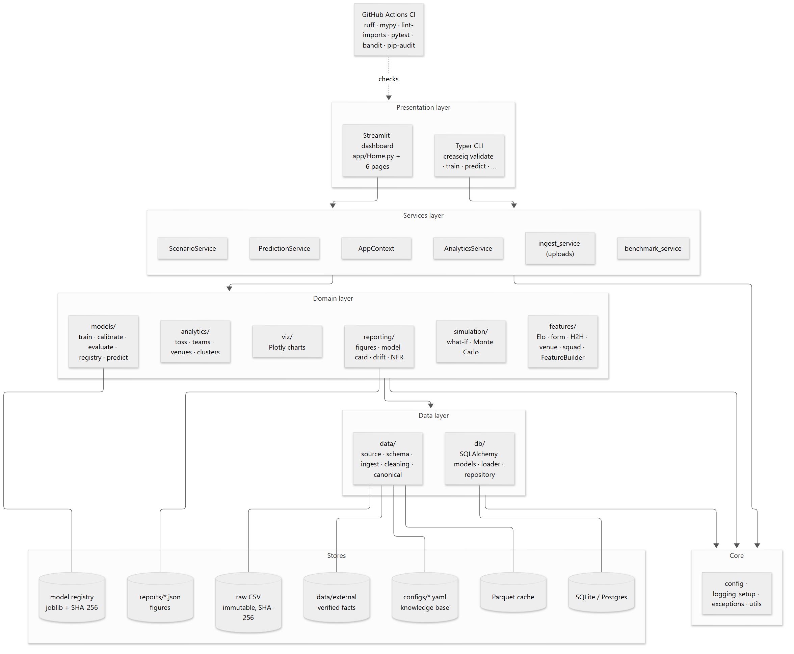

# CreaseIQ: IPL Match Intelligence Platform

[](https://github.com/OWNER/creaseiq/actions/workflows/ci.yml)


> A validated IPL data pipeline, statistically sound analytics, and a leakage-safe, calibrated pre-match win-probability engine that reports its real accuracy.
> *Build Your Own Project (VITyarthi) · Machine Learning · Jyotshna Payasi (26BCE10651), VIT Bhopal*



## Overview
CreaseIQ turns a raw IPL match file (1,243 matches, 2008–2026, Cricsheet-derived) into:

1. **A clean, canonical, validated dataset.**
   - 19 team strings map to 15 franchises, and 60 venue strings to 37 venues.
   - Super-over runs are removed from tied innings.
   - D/L results and a voided match are flagged.
   - Every change is counted in [`docs/data_quality_report.md`](docs/data_quality_report.md).
2. **Honest analytics.**
   - Does the toss matter? A causal binomial test with confidence interval (CI) and minimum detectable effect.
   - Is chasing easier? How much did the Impact Player rule change scoring?
3. **A win-probability model built the right way.**
   - Every feature is computed *as of the day before* the match, and five automated leakage tests check this.
   - Orientation is symmetric, so which team you list first does not matter.
   - Walk-forward validation and calibration.
   - Baselines and bootstrap CIs, with a holdout evaluated **once**.

The headline finding is that pre-match IPL outcomes are close to a coin flip. CreaseIQ measures that honestly instead of claiming 90% accuracy.

## Results (generated from `reports/metrics.json`)
<!-- RESULTS:START -->
**Analytics.**

- Toss winners won **51.6%** (95% CI 48.8%–54.4%, p = 0.29). There is no detectable toss advantage.
- The chasing side won **54.7%** (p = 0.001).
- First-innings scores rose by **+27.1 runs** in the Impact Player era (Cohen's d = 0.82).

**Win-probability models.** Walk-forward validation used development seasons ≤ 2024; the holdout, 2025, 2026, was evaluated once. A coin flip scores log-loss 0.6931.

| Tier | Model | Walk-forward log-loss | Holdout log-loss [95% CI] | Holdout accuracy | Holdout AUC |
|---|---|---|---|---|---|
| post_toss | logreg | 0.6857 | 0.6974 [0.6818, 0.7136] | 47.9% | 0.489 |
| pre_toss | elo_logit | 0.6900 | 0.7060 [0.6889, 0.7234] | 43.0% | 0.453 |

**Honest verdict.** The models edge a coin flip in walk-forward validation, but none of them beats it on the 2025–26 holdout: relationships learned before 2023 weakened. See [`docs/model_card.md`](docs/model_card.md).

**Performance.** The full pipeline takes 6.6 s. A warm prediction takes 8.8 ms, and the slowest dashboard page renders in 0.51 s. Peak memory is 40 MB.
<!-- RESULTS:END -->

## Features

| Module | What it does | Requirements |
|---|---|---|
| **M1 Data engineering** | Schema and row-rule validation with quarantine; fail-loud canonicalisation; tie, D/L and voided-match handling; quality report and data dictionary; normalised SQLite; validated CSV append | FR-01…05 |
| **M2 Analytics & visualisation** | Team records with Wilson CIs, titles, head-to-head, Elo history; causal toss test; chasing and era tests; shrunk venue profiles and k-means clusters; scoring trends; POTM leaderboards; filters and safe CSV export | FR-06…11 |
| **M3 Prediction engine** | As-of FeatureBuilder; margin-aware Elo; 5 model families plus 5 baselines; walk-forward CV; one-SE selection; time-ordered calibration; bootstrap and paired tests; hash-verified registry; explanations; score regressor | FR-12…18 |
| **M4 Scenarios** | What-if tornado (toss, venue, opponent); Monte Carlo season simulation | FR-19, FR-20 |
| **M5 Ops & reporting** | key=value logs with run ids; prediction log; PSI drift; model card, figures and NFR evidence | FR-21, FR-22 |

Dashboard pages: Home · Data Explorer · Team Analytics · Venue & Toss · Predict Match · Model Lab · What-If.

## Technologies
- **Language:** Python 3.12/3.13.
- **Data and statistics:** pandas 3, NumPy, SciPy, statsmodels.
- **Machine learning:** scikit-learn (logistic regression, random forest, histogram gradient boosting, k-means).
- **Validation:** pandera.
- **Storage:** SQLAlchemy 2 with SQLite (Postgres via URL).
- **Interfaces:** Streamlit and Plotly (dashboard), Typer and Rich (CLI).
- **Figures:** matplotlib.
- **Quality:** pytest, Hypothesis, ruff, mypy, import-linter, bandit, pip-audit, GitHub Actions.
- **Documentation:** Mermaid (diagrams), Playwright/Chromium (screenshots and the PDF report).

## Install & run

Needs Python ≥ 3.12. Node ≥ 22.13 is optional and only needed for re-rendering diagrams and the PDF.

**Windows (PowerShell)**

```bash
py -3.12 -m venv .venv
```

```bash
.venv\Scripts\activate
```

**macOS / Linux**

```bash
python3.12 -m venv .venv
```

```bash
source .venv/bin/activate
```

**Install (both platforms)**

```bash
pip install -r requirements.txt -r requirements-dev.txt
```

```bash
pip install -e . --no-deps
```

**Run the whole pipeline** (validate → build-db → analyze → train):

```bash
creaseiq all
```

**Start the dashboard:**

```bash
streamlit run src/creaseiq/app/Home.py
```

**Useful CLI commands** (`creaseiq --help` lists them all):

```bash
creaseiq predict mi csk --venue wankhede
```

```bash
creaseiq predict mi csk --venue wankhede --toss-winner csk --toss-decision field
```

```bash
creaseiq whatif rcb gt --venue narendra_modi
```

```bash
creaseiq ingest --append new_matches.csv --dry-run
```

```bash
creaseiq benchmark
```

## Testing

```bash
pytest
```

```bash
pytest --cov
```

```bash
ruff check . && mypy src && lint-imports
```

There are more than 200 tests:
- **Unit:** including Hypothesis property tests.
- **Data contract.**
- **Leakage:** future perturbation, same-day isolation, label shuffle, column allow-list, orientation signal.
- **Reproducibility.**
- **Security:** secrets scan, SQL-injection strings, tampered artifacts, CSV injection, upload guards.
- **Streamlit:** `AppTest` for every page.
- **CLI:** `CliRunner`.
- **Performance.**

Coverage and NFR evidence are in [`docs/nfr_verification.md`](docs/nfr_verification.md).

## Screenshots

| Home | Venue & Toss |
|---|---|
|  |  |
| **Model Lab** | **What-If** |
|  |  |

## Architecture



Dependencies point downward only: app/cli → services → domain → data → core. This is enforced by import-linter and an AST test. All diagrams (use case, workflow, sequence, class, component, ER, deployment) are in [`docs/diagrams/`](docs/diagrams/). The rationale is in [`docs/architecture.md`](docs/architecture.md) and [`docs/decisions/`](docs/decisions/).

## Project structure
```
configs/        config.yaml · team_lineage.yaml · venue_canonical.yaml · home_grounds.yaml
data/           raw/ (immutable CSV + SHA-256) · external/ (verified facts) · processed/ (generated)
src/creaseiq/   data · db · analytics · features · models · simulation · services · viz · reporting · app · cli
tests/          unit · integration · validation (leakage, security, reproducibility) · fixtures
docs/           research notes · plan review · ADRs · diagrams · model card · data dictionary · viva prep
reports/        metrics.json · analytics.json · perf.json · coverage.json · figures/
models/         registry.json + hash-verified artifacts
report/         PDF report builder and CreaseIQ_Project_Report.pdf
```

## Disclaimer
CreaseIQ is an educational analytics project. Its statistics and probabilities are retrospective, uncertain and close to a coin flip.
- **They are not betting, fantasy-sports or financial advice.** Do not use them to stake money on any match. In India, the Promotion and Regulation of Online Gaming Act, 2025 prohibits online money games.
- CreaseIQ is not affiliated with the BCCI, the IPL, any franchise or Cricsheet.

## Data attribution & license
- **Match data:** [Cricsheet](https://cricsheet.org), compiled by Stephen Rushe and made available under the [Open Data Commons Attribution License v1.0](https://opendatacommons.org/licenses/by/1-0/). It was probably obtained through a Kaggle re-packaging ("IPL Complete Cricket Dataset (2008–2026)"). CreaseIQ transformed the data; any errors are ours.
- **Code:** [MIT](LICENSE). The licence does not cover `data/raw/`.

## AI assistance & sources
- **Tools:** this project was built with AI coding assistance (Claude Code) for scaffolding, research and review.
- **Oversight:** the author reviewed the design and code, and can explain every part (see [`docs/viva_prep.md`](docs/viva_prep.md)).
- **Sources:** every external source is cited in [`docs/research_notes.md`](docs/research_notes.md).

## Author
Jyotshna Payasi · Reg. No. 26BCE10651 · Vellore Institute of Technology, Bhopal
